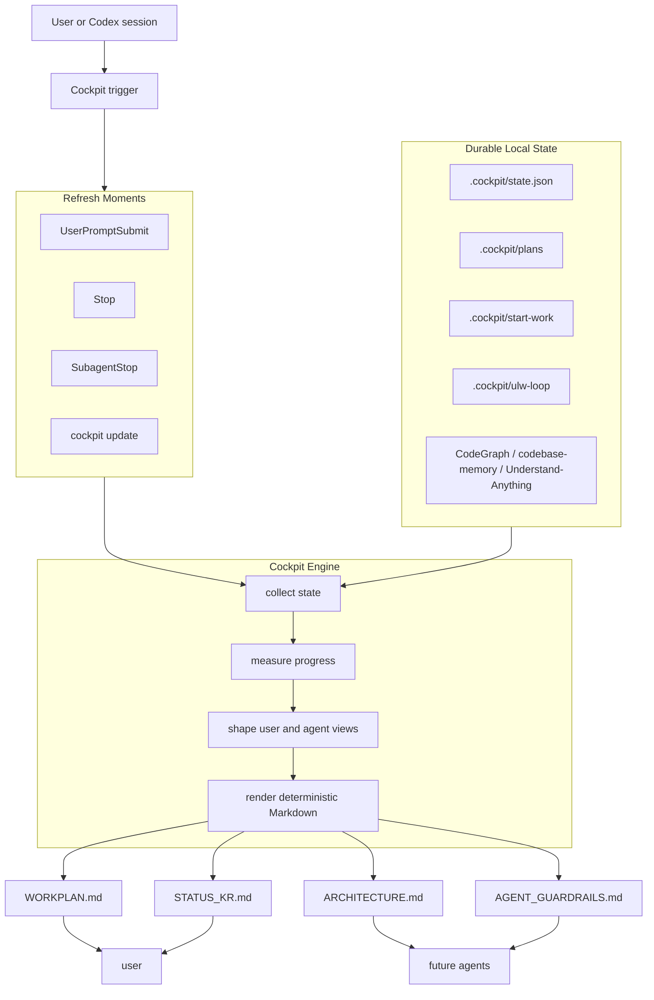

# Cockpit

<p align="center">
  <strong>English</strong> · <a href="./docs/README.ko.md">한국어</a>
</p>

<p align="center">
  
</p>

<p align="center">
  <a href="https://github.com/foxion37/cockpit/actions/workflows/check.yml"></a>
  
  
</p>

Cockpit is a dot-image flavored Markdown command center for long-running Codex work. It turns local plans, progress ledgers, graph-source hints, and session state into four readable files under `.cockpit/`.

It is intentionally narrow: one surface, four files, deterministic Markdown, and no extra dashboard sprawl.

### Design Intent

Cockpit is a small guardrail bundle for people working with coding agents. It helps beginners avoid drifting off course while repeatedly approving agent actions they cannot fully inspect yet.

When developer terminology gets dense, Cockpit gives you a place to check where the work is, what has changed, and what the agent should pay attention to next. You can also point the agent back to the Cockpit files and ask it to verify its work against them.

Cockpit works best with careful planning. The more detailed the plan is, especially when it comes from a deep conversation about intent, phases, and success criteria, the more accurately Cockpit can summarize progress and keep the session grounded.

### Use Scenes

Cockpit is useful when a session has enough moving parts that plain chat history stops being a good source of truth.

| Scene | What Cockpit Gives You |
| --- | --- |
| Long implementation loop | A stable workplan with phase and batch progress |
| Multi-agent handoff | Guardrails and mutation boundaries for the next agent |
| Architecture-heavy work | A Mermaid map plus graph-source status |
| Korean status reporting | A concise `/cavexplain` style progress note |
| Noisy project state | One generated dashboard instead of many status files |

### What Cockpit Writes

```text
.cockpit/
├─ WORKPLAN.md          overall plan, phase progress, batch progress
├─ ARCHITECTURE.md      Mermaid architecture and local graph-source status
├─ STATUS_KR.md         Korean progress summary in /cavexplain style
└─ AGENT_GUARDRAILS.md  concise guardrails for future agents
```

`WORKPLAN.md` is the main cockpit. It includes the current progress, phase and batch breakdowns, blockers, durable state sources, and text graphics such as pulse boards and radar-style status blocks.

`ARCHITECTURE.md` explains how the current codebase is being understood. It renders a Mermaid diagram and reports the local status of graph sources such as CodeGraph, codebase-memory, and Understand-Anything style indexes when present.

`STATUS_KR.md` is the human-facing Korean summary. It keeps the tone short and direct, shaped for `/cavexplain`: `결론`, `근거`, `리스크`, and `다음`.

`AGENT_GUARDRAILS.md` is for the next agent. It captures mutation boundaries, source-of-truth files, and things not to infer from stale generated output.

### Gauge Accents

Gauge graphics are a visual accent, not the core contract. They make progress easier to scan in GitHub, terminals, saved logs, and agent handoffs.

```text
┌─ Pulse Board ─────────────────────────────────┐
│ overall     78%  ████████████░░░  moving      │
│ plan        90%  █████████████░░  stable      │
│ code        72%  ███████████░░░░  active      │
│ qa          44%  ███████░░░░░░░░  watch       │
└───────────────────────────────────────────────┘

Radar
scope        graph       memory      handoff
████████░░   ██████░░░░  ███████░░░  █████████░
```

When Unicode is not safe, switch to ASCII:

```text
overall     78%  ############---  moving
plan        90%  #############--  stable
qa          44%  #######--------  watch
```

### Architecture



### Text Graphics

Cockpit uses Unicode bars by default because Markdown status should still be pleasant to scan:

```text
전체 진행률  78%  ████████████░░░
Phase A     100% ███████████████
Phase B      65% █████████░░░░░░
Phase C      20% ███░░░░░░░░░░░░
```

Use ASCII mode when logs or terminals need plain characters:

```sh
COCKPIT_ASCII=1 cockpit update --repo-root "$PWD" --json
```

### Usage

```sh
npm install
npm run build
node dist/cli.js cockpit update --repo-root "$PWD" --json
```

After linking or installing the package:

```sh
cockpit update --repo-root "$PWD" --json
```

The legacy plugin-style command remains supported:

```sh
cockpit cockpit update --repo-root "$PWD" --json
```

### Hooks

Cockpit is designed to refresh automatically inside a Codex plugin session:

- `UserPromptSubmit` refreshes only for Cockpit or skill-related prompts.
- `Stop` refreshes the dashboard after work completes.
- `SubagentStop` refreshes when a subagent finishes.
- Hook failures return empty output so they do not block other hook behavior.

### Development

```sh
npm test
npm run check
npm run build
```

The GitHub Actions workflow runs `npm ci`, `npm test`, and `npm run check` on every push and pull request.

## License

MIT
