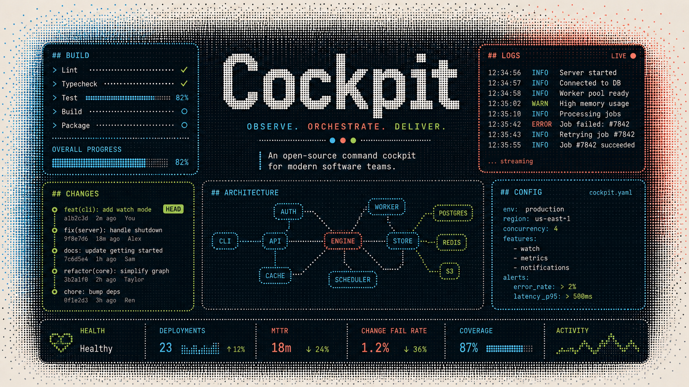
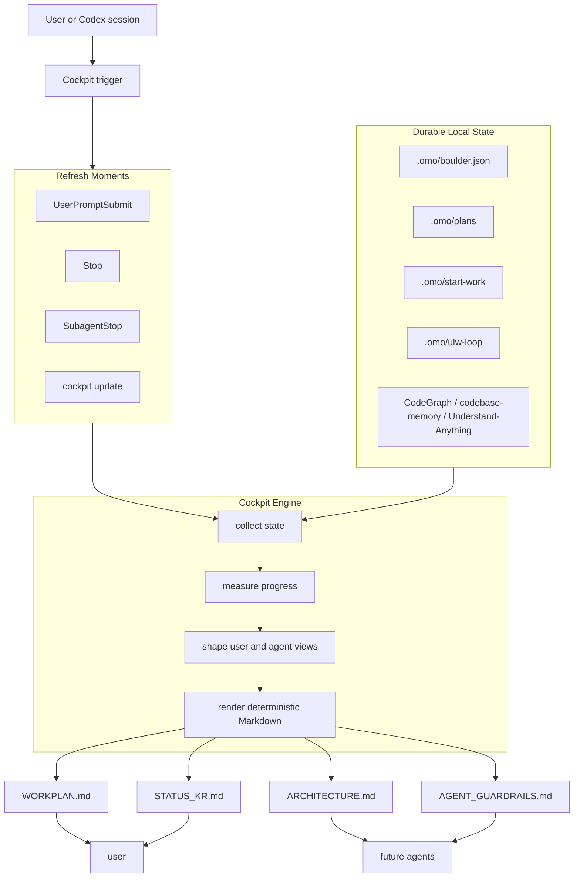
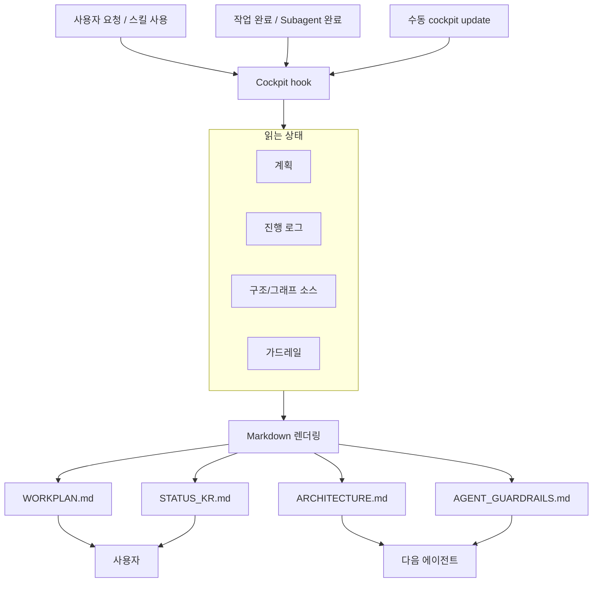

# Cockpit

<p align="center">
  
</p>

<p align="center">
  <a href="https://github.com/foxion37/cockpit/actions/workflows/check.yml"></a>
  
  
</p>

Cockpit is a dot-image flavored Markdown command center for long-running Codex work. It turns local plans, progress ledgers, graph-source hints, and session state into four readable files under `.omo/cockpit/`.

It is intentionally narrow: one surface, four files, deterministic Markdown, and no extra dashboard sprawl.

## English

### Use Scenes

Cockpit is useful when a session has enough moving parts that plain chat history stops being a good source of truth.

| Scene | What Cockpit Gives You |
| --- | --- |
| Long implementation loop | A stable workplan with phase and batch progress |
| Multi-agent handoff | Guardrails and mutation boundaries for the next agent |
| Architecture-heavy work | A Mermaid map plus graph-source status |
| Korean status reporting | A concise `/cavexplain` style progress note |
| Noisy project state | One generated dashboard instead of many status files |

### What Cockpit Writes

```text
.omo/cockpit/
├─ WORKPLAN.md          overall plan, phase progress, batch progress
├─ ARCHITECTURE.md      Mermaid architecture and local graph-source status
├─ STATUS_KR.md         Korean progress summary in /cavexplain style
└─ AGENT_GUARDRAILS.md  concise guardrails for future agents
```

`WORKPLAN.md` is the main cockpit. It includes the current progress, phase and batch breakdowns, blockers, durable state sources, and text graphics such as pulse boards and radar-style status blocks.

`ARCHITECTURE.md` explains how the current codebase is being understood. It renders a Mermaid diagram and reports the local status of graph sources such as CodeGraph, codebase-memory, and Understand-Anything style indexes when present.

`STATUS_KR.md` is the human-facing Korean summary. It keeps the tone short and direct, shaped for `/cavexplain`: `결론`, `근거`, `리스크`, and `다음`.

`AGENT_GUARDRAILS.md` is for the next agent. It captures mutation boundaries, source-of-truth files, and things not to infer from stale generated output.

### Gauge Graphics

The heart of Cockpit is readable text graphics. They work in GitHub, terminals, saved logs, and agent handoffs.

```text
┌─ Pulse Board ─────────────────────────────────┐
│ overall     78%  ████████████░░░  moving      │
│ plan        90%  █████████████░░  stable      │
│ code        72%  ███████████░░░░  active      │
│ qa          44%  ███████░░░░░░░░  watch       │
└───────────────────────────────────────────────┘

Radar
scope        graph       memory      handoff
████████░░   ██████░░░░  ███████░░░  █████████░
```

When Unicode is not safe, switch to ASCII:

```text
overall     78%  ############---  moving
plan        90%  #############--  stable
qa          44%  #######--------  watch
```

### Architecture



### Text Graphics

Cockpit uses Unicode bars by default because Markdown status should still be pleasant to scan:

```text
전체 진행률  78%  ████████████░░░
Phase A     100% ███████████████
Phase B      65% █████████░░░░░░
Phase C      20% ███░░░░░░░░░░░░
```

Use ASCII mode when logs or terminals need plain characters:

```sh
OMO_COCKPIT_ASCII=1 cockpit update --repo-root "$PWD" --json
```

### Usage

```sh
npm install
npm run build
node dist/cli.js cockpit update --repo-root "$PWD" --json
```

After linking or installing the package:

```sh
cockpit update --repo-root "$PWD" --json
```

The legacy plugin-style command remains supported:

```sh
cockpit cockpit update --repo-root "$PWD" --json
```

### Hooks

Cockpit is designed to refresh automatically inside a Codex/OMO plugin session:

- `UserPromptSubmit` refreshes only for Cockpit, OMO, or skill-related prompts.
- `Stop` refreshes the dashboard after work completes.
- `SubagentStop` refreshes when a subagent finishes.
- Hook failures return empty output so they do not block other hook behavior.

### Development

```sh
npm test
npm run check
npm run build
```

The GitHub Actions workflow runs `npm ci`, `npm test`, and `npm run check` on every push and pull request.

## 한국어

### Cockpit은 무엇인가요?

Cockpit은 긴 Codex 작업을 위한 dot-image 감성의 작은 Markdown 조종석입니다. 계획, 진행률, 세션 상태, 구조 이해 정보를 모아서 `.omo/cockpit/` 아래 네 개 파일로 정리합니다.

핵심은 단순함입니다. 파일을 많이 만들지 않고, 매번 같은 구조로 갱신하며, 사람이 보는 요약과 에이전트가 참고할 가드레일을 분리합니다.

### 사용 장면

| 장면 | Cockpit이 해주는 일 |
| --- | --- |
| 작업이 길어질 때 | 전체 계획과 페이즈/배치 진행률을 한눈에 보여줍니다 |
| 여러 에이전트가 이어받을 때 | 다음 에이전트가 지켜야 할 경계와 원본 상태를 알려줍니다 |
| 코드 구조를 계속 파악해야 할 때 | Mermaid 구조도와 그래프 소스 상태를 같이 보여줍니다 |
| 한글 진행 보고가 필요할 때 | `/cavexplain` 말투로 짧고 분명하게 정리합니다 |
| 상태 파일이 너무 많아질 때 | 핵심 Cockpit 파일 네 개로 표면을 줄입니다 |

### 생성되는 파일

```text
.omo/cockpit/
├─ WORKPLAN.md          전체 작업계획, 현재 진행률, 페이즈/배치 진행률
├─ ARCHITECTURE.md      Mermaid 구조도와 로컬 그래프 소스 상태
├─ STATUS_KR.md         /cavexplain 말투의 한글 진행상황
└─ AGENT_GUARDRAILS.md  다른 에이전트가 참고할 작업 경계와 주의사항
```

`WORKPLAN.md`는 메인 화면입니다. 전체 진행률, 현재 페이즈, 세부 배치, 막힌 점, 다음 작업, 텍스트 그래픽을 한곳에 보여줍니다.

`ARCHITECTURE.md`는 코드베이스를 어떻게 이해하고 있는지 보여줍니다. CodeGraph, codebase-memory, Understand-Anything 계열 소스가 있으면 그 상태를 함께 표시합니다.

`STATUS_KR.md`는 사용자가 바로 읽는 한글 요약입니다. `/cavexplain`처럼 짧고 선명하게 `결론`, `근거`, `리스크`, `다음` 중심으로 씁니다.

`AGENT_GUARDRAILS.md`는 다음 에이전트를 위한 파일입니다. 어디를 수정해도 되는지, 무엇을 원본 상태로 봐야 하는지, 오래된 출력에서 추론하면 안 되는 점을 적습니다.

### 게이지 그래픽

Cockpit의 정수는 Markdown 안에서 읽히는 예쁜 텍스트 그래픽입니다.

```text
┌─ 진행 레이더 ─────────────────────────────────┐
│ 전체        78%  ████████████░░░  순항        │
│ 계획        90%  █████████████░░  안정        │
│ 구현        72%  ███████████░░░░  진행        │
│ 검증        44%  ███████░░░░░░░░  주시        │
└───────────────────────────────────────────────┘

구조 이해     ████████░░
메모리 연결   ██████░░░░
인수인계      █████████░
```

터미널이나 로그에서 Unicode가 부담스러우면 ASCII 모드로 바꿀 수 있습니다.

```sh
OMO_COCKPIT_ASCII=1 cockpit update --repo-root "$PWD" --json
```

### 동작 구조



### 언제 업데이트되나요?

Codex/OMO plugin session 안에서는 hook을 통해 자동 갱신됩니다.

- Cockpit/OMO/skill 관련 프롬프트가 들어오면 필요한 경우 갱신합니다.
- 작업이 끝나는 `Stop` 시점에 갱신합니다.
- 서브에이전트가 끝나는 `SubagentStop` 시점에 갱신합니다.
- hook 실패는 다른 작업을 막지 않도록 빈 출력으로 처리합니다.

수동 갱신도 가능합니다.

```sh
cockpit update --repo-root "$PWD" --json
```

### 개발

```sh
npm install
npm test
npm run check
npm run build
```

## License

MIT
